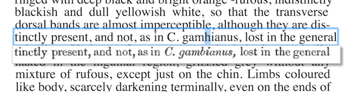

OCR correction in browser for Leiden Hackathon
==============================================

A web interface for correcting OCR text from the Biodiversity Heritage Library as DjVu XML files and corresponding full page png images. The goal is to provide a simple interface for interactive editing of text, as well as tools to make inferences from the edits (e.g., frequency of certain kinds of OCR errors).

The [hackathon](http://www.naturalis.nl/en/news/bioinformatics/hackathon-nutshell/) took place March 2014 in Leiden, the Netherlands and was sponsored by [Naturalis Biodiversity Center](http://www.naturalis.nl/) and [pro-iBiosphere](http://www.pro-ibiosphere.eu/). See the [follow-up paper](http://doi.org/10.3897/BDJ.2.e1125) in the Biodiversity Data Journal.

## Requirements & Dependencies

This code requires [CouchDB](http://couchdb.apache.org), PHP 5.6+, and a local web server such as Apache with mod\_rewrite enabled. Install all necessary dependencies using [composer](https://getcomposer.org) and update them as required from the ocr-correction source directory.

    $ composer install
    $ composer update

## Configuration

Rename /config/config.php.sample to /config/config.php and adjust as necessary

Example Apache VirtualHost
--------------------------

    <VirtualHost *:80>
      ServerName www.ocr-correction.local
      ServerAlias ocr-correction.local
      DocumentRoot /Users/dshorthouse/Sites/ocr-correction
      <Directory "/Users/dshorthouse/Sites/ocr-correction">
        Options -Indexes +FollowSymlinks
        AllowOverride None
        Require all granted
        DirectoryIndex index.php
        RewriteEngine on
        RewriteBase /
        RewriteRule ^(public|sitemap.xml|robots.txt)($|/) - [L]
        RewriteCond %{DOCUMENT_ROOT}%{REQUEST_FILENAME} !-f
        RewriteCond %{DOCUMENT_ROOT}%{REQUEST_FILENAME} !-d
        RewriteRule ^(.*)$ index.php?q=$1 [L,QSA]
      </Directory>
    </VirtualHost>

If you use something like www.ocr-correction.local for the ServerName, don't forget to adjust your /etc/hosts file.

### Create database and views

Use the included, self-executable command-line utility to create the database and two necessary views:

    $ ./bin/initialize.php --create

## Page images and DjVu XML files

You can fetch page images and DjVu XML from BioStor.

[http://biostor.org/bhl_page_xml.php?PageID=34570741](http://biostor.org/bhl_page_xml.php?PageID=34570741)  
[http://biostor.org/bhl_page_bw_image.php?PageID=34570741](http://biostor.org/bhl_page_bw_image.php?PageID=34570741)

## Running in the Browser

Assuming your application is running via www.ocr-correction.local, you can access the included /public/examples by appending the PageId as part of the path:

http://www.ocr-correction.local/16002437

## Tests

PHPUnit is used for unit tests and [Selenium](http://selenium-release.storage.googleapis.com/index.html?path=2.53/) and Facebook's [php-webdriver](https://github.com/facebook/php-webdriver) are used for integration tests. [Composer](https://getcomposer.org/) is used to include dependencies.

### FireFox

    $ java -jar selenium-server-standalone-2.53.1.jar

Then from a second terminal window:

    $ ./vendor/bin/phpunit -c Tests/firefox.phpunit.xml

### Chrome

If you wish to use Chrome instead of FireFox, the Selenium Chromedriver can be found at [http://chromedriver.storage.googleapis.com/index.html](http://chromedriver.storage.googleapis.com/index.html):

    $ java -jar selenium-server-standalone-2.53.1.jar -Dwebdriver.chrome.driver=/usr/local/bin/chromedriver

Then from a second terminal window:

    $ ./vendor/bin/phpunit -c Tests/chrome.phpunit.xml

### Test Suites

Tests are split into suites entitled, "Unit", "Functional"

    $ ./vendor/bin/phpunit -c Tests/chrome.phpunit.xml --testsuite "Unit"

## The MIT License (MIT)

Copyright (c) 2014
[Roderic Page](https://github.com/rdmpage), [David P. Shorthouse](https://github.com/dshorthouse), Kevin Richards, Marko Tähtinen and the agents they represent

Permission is hereby granted, free of charge, to any person obtaining a copy
of this software and associated documentation files (the "Software"), to deal
in the Software without restriction, including without limitation the rights
to use, copy, modify, merge, publish, distribute, sublicense, and/or sell
copies of the Software, and to permit persons to whom the Software is
furnished to do so, subject to the following conditions:

The above copyright notice and this permission notice shall be included in
all copies or substantial portions of the Software.

THE SOFTWARE IS PROVIDED "AS IS", WITHOUT WARRANTY OF ANY KIND, EXPRESS OR
IMPLIED, INCLUDING BUT NOT LIMITED TO THE WARRANTIES OF MERCHANTABILITY,
FITNESS FOR A PARTICULAR PURPOSE AND NONINFRINGEMENT. IN NO EVENT SHALL THE
AUTHORS OR COPYRIGHT HOLDERS BE LIABLE FOR ANY CLAIM, DAMAGES OR OTHER
LIABILITY, WHETHER IN AN ACTION OF CONTRACT, TORT OR OTHERWISE, ARISING FROM,
OUT OF OR IN CONNECTION WITH THE SOFTWARE OR THE USE OR OTHER DEALINGS IN
THE SOFTWARE.